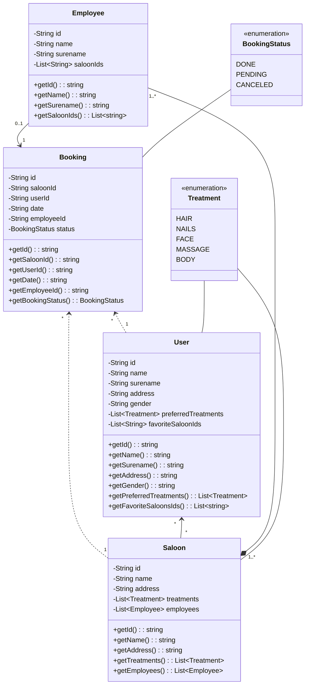

<h2 style="text-align: center">Class diagram</h2>

```mermaid
classDiagram
  %% Main relationships
  Booking "*" <.. "1" User
  Booking "*" <.. "1" Saloon
  User "*" <-- "*" Saloon
  Employee "0..1" --> "1" Booking
  Employee "1,,*" --* "1,,*" Saloon

  %% Enum relationships
  Treatment -- User
  Treatment -- Saloon
  BookingStatus -- Booking

  %% Classes
  class User {
    -String id
    -String name
    -String surename
    -String address
    -String gender
    -List~Treatment~ preferredTreatments
    -List~String~ favoriteSaloonIds
    +getId(): string
    +getName(): string
    +getSurename(): string
    +getAddress(): string
    +getGender(): string
    +getPreferredTreatments(): List~Treatment~
    +getFavoriteSaloonsIds(): List~string~
  }
  class Saloon {
    -String id
    -String name
    -String address
    -List~Treatment~ treatments
    -List~Employee~ employees
    +getId(): string
    +getName(): string
    +getAddress(): string
    +getTreatments(): List~Treatment~
    +getEmployees(): List~Employee~
  }
  class Booking {
    -String id
    -String saloonId
    -String userId
    -String date
    -String employeeId
    -BookingStatus status
    +getId(): string
    +getSaloonId(): string
    +getUserId(): string
    +getDate(): string
    +getEmployeeId(): string
    +getBookingStatus(): BookingStatus
  }
  class Employee {
    -String id
    -String name
    -String surename
    -List~String~ saloonIds
    +getId(): string
    +getName(): string
    +getSurename(): string
    +getSaloonIds(): List~string~
  }
  class Treatment {
    <<enumeration>>
    HAIR
    NAILS
    FACE
    MASSAGE
    BODY
  }
  class BookingStatus {
    <<enumeration>>
    DONE
    PENDING
    CANCELED
  }
```