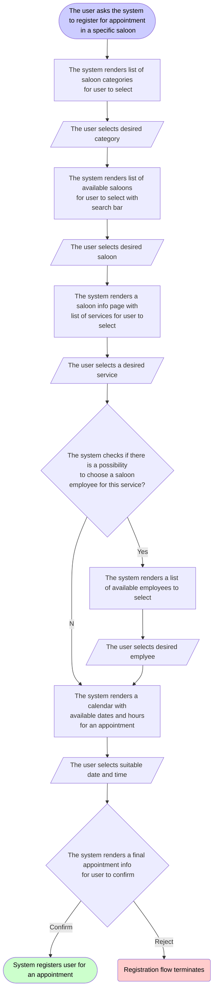

```mermaid
  
flowchart TD;
   %% Trigger event
   TRIGGER([The user asks the system to register for appointment<br /> in a specific saloon])-->S1;
   style TRIGGER fill:#ccf,color:black
 
   %% Main success scenario
   S1[The system renders list of saloon categories<br /> for user to select]-->S2;
   S2[/The user selects desired category/]-->S3;
   S3[The system renders list of available saloons<br /> for user to select with search bar]-->S4;
   S4[/The user selects desired saloon/]-->S5;
   S5[The system renders a saloon info page with<br /> list of services for user to select]-->S6;
   S6[/The user selects a desired service/]-->S7;
   S7{The system checks if there is a possibility<br /> to choose a saloon employee for this service?};
   S7--Yes-->S8;
   S7--No-->S10;
   S8[The system renders a list of available employees to select]-->S9;
   S9[/The user selects desired emplyee/]-->S10;
   S10[The system renders a calendar with<br /> available dates and hours for an appointment]-->S11;
   S11[/The user selects suitable date and time/]-->S12;
   S12{The system renders a final appointment info<br/> for user to confirm};
   S12--Confirm-->SUCCESS;
   S12--Reject-->FAILURE;
 
   SUCCESS([System registers user for an appointment]);
   style SUCCESS fill:#cfc,color:black
 
   FAILURE(Registration flow terminates);
   style FAILURE fill:#fcc,color:black
```
